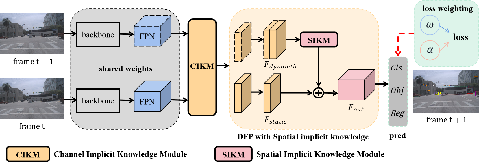

# ISYOLO

## Exploiting implicit knowledge for streaming perception object detection
<p align='left'>
  
</p>

[Qingsong Tang], [Jinting Guo], [Xuexiao Zhou], [Yongkang Li], [Mingzhi Yang], [Yang Liu] <br>
Exploiting implicit knowledge for streaming perception object detection, (Submited)<br>
**[[Paper]]** <br />


## Benchmark

|Model |size |velocity | sAP<br>0.5:0.95 | sAP50 |sAP75| weights | COCO pretrained weights |
| ------        |:---: | :---:       |:---:     |:---:  | :---: | :----: | :----: |
|[ISYOLO-s](./cfgs/s_s50_onex_dfp_tal_flip.py)    |600×960  |1x      |29.8     |49.1 | 30.1 |[github](https://github.com/GjtZ/ISYOLO/releases/download/0.1.0/s_s50_one_x_2976.pth) |[github](https://github.com/GjtZ/ISYOLO/releases/download/0.1.0/yolox_s.pth) |
|[ISYOLO-m](./cfgs/m_s50_onex_dfp_tal_flip.py)    |600×960  |1x      |34.3     |55.0 | 35.2 |[github](https://github.com/GjtZ/ISYOLO/releases/download/0.1.0/m_s50_one_x_3431.pth) |[github](https://github.com/GjtZ/ISYOLO/releases/download/0.1.0/yolox_m.pth) |
|[ISYOLO-l](./cfgs/l_s50_onex_dfp_tal_flip.py)    |600×960  |1x      |37.8     |58.4 | 38.2 |[github](https://github.com/GjtZ/ISYOLO/releases/download/0.1.0/l_s50_one_x_3776.pth) |[github](https://github.com/GjtZ/ISYOLO/releases/download/0.1.0/yolox_l.pth) |

## Quick Start

<details>
<summary>Dataset preparation</summary>

You can download Argoverse-1.1 full dataset and annotation from [HERE](https://www.cs.cmu.edu/~mengtial/proj/streaming/) and unzip it.

The folder structure should be organized as follows before our processing.

```shell
ISYOLO
├── exps
├── tools
├── yolox
├── data
│   ├── Argoverse-1.1
│   │   ├── annotations
│   │       ├── tracking
│   │           ├── train
│   │           ├── val
│   │           ├── test
│   ├── Argoverse-HD
│   │   ├── annotations
│   │       ├── test-meta.json
│   │       ├── train.json
│   │       ├── val.json
```

The hash strings represent different video sequences in Argoverse, and `ring_front_center` is one of the sensors for that sequence. Argoverse-HD annotations correspond to images from this sensor. Information from other sensors (other ring cameras or LiDAR) is not used, but our framework can be also extended to these modalities or to a multi-modality setting.


</details>


<details>
<summary>Installation</summary>

```shell
# basic python libraries
conda create --name streamyolo python=3.7

pip install torch==1.7.1+cu110 torchvision==0.8.2+cu110 torchaudio==0.7.2 -f https://download.pytorch.org/whl/torch_stable.html

pip3 install yolox==0.3
git clone git@github.com:yancie-yjr/StreamYOLO.git


cd ISYOLO/

# add StreamYOLO to PYTHONPATH and add this line to ~/.bashrc or ~/.zshrc (change the file accordingly)
ADDPATH=$(pwd)
echo export PYTHONPATH=$PYTHONPATH:$ADDPATH >> ~/.bashrc
source ~/.bashrc

# Installing `mmcv` for the official sAP evaluation:
# Please replace `{cu_version}` and ``{torch_version}`` with the versions you are currently using.
# You will get import or runtime errors if the versions are incorrect.
pip install mmcv-full==1.1.5 -f https://download.openmmlab.com/mmcv/dist/{cu_version}/{torch_version}/index.html

```

</details>


<details>
<summary>Reproduce our results on Argoverse-HD</summary>

Step1. Prepare COCO dataset
```shell
cd <ISYOLO_HOME>
ln -s /path/to/your/Argoverse-1.1 ./data/Argoverse-1.1
ln -s /path/to/your/Argoverse-HD ./data/Argoverse-HD
```

Step2. Reproduce our results on Argoverse:

```shell
python tools/train.py -f cfgs/m_s50_onex_dfp_tal_flip.py -d 8 -b 32 -c [/path/to/your/coco_pretrained_path] -o --fp16
```
* -d: number of gpu devices.
* -b: total batch size, the recommended number for -b is num-gpu * 8.
* --fp16: mixed precision training.
* -c: model checkpoint path.

</details>


<details>
<summary>Offline Evaluation</summary>

We support batch testing for fast evaluation:

```shell
python tools/eval.py -f  cfgs/l_s50_onex_dfp_tal_flip.py -c [/path/to/your/model_path] -b 64 -d 8 --conf 0.01 [--fp16] [--fuse]
```
* --fuse: fuse conv and bn.
* -d: number of GPUs used for evaluation. DEFAULT: All GPUs available will be used.
* -b: total batch size across on all GPUs.
* -c: model checkpoint path.
* --conf: NMS threshold. If using 0.001, the performance will further improve by 0.2~0.3 sAP.

</details>

<details>
<summary>Online Evaluation</summary>

We modify the online evaluation from [sAP](https://github.com/mtli/sAP)

Please use 1 V100 GPU to test the performance since other GPUs with low computing power will trigger non-real-time results!!!!!!!!

```shell
cd sAP/streamyolo
bash my_streamyolo.sh
```

</details>


## Citation
Please cite the following paper if this repo helps your research:
```bibtex
@inproceedings{streamyolo,
  title={Exploiting implicit knowledge for streaming perception object detection},
  author={Yang, Jinrong and Liu, Songtao and Li, Zeming and Li, Xiaoping and Sun, Jian},
  booktitle={Proceedings of the IEEE/CVF Conference on Computer Vision and Pattern Recognition},
  pages={5385--5395},
  year={2022}
}
@article{yang2022streamyolo,
  title={StreamYOLO: Real-time Object Detection for Streaming Perception},
  author={Yang, Jinrong and Liu, Songtao and Li, Zeming and Li, Xiaoping and Sun, Jian},
  journal={arXiv preprint arXiv:2207.10433},
  year={2022}
}
```

## License
This repo is released under the Apache 2.0 license. Please see the LICENSE file for more information.

